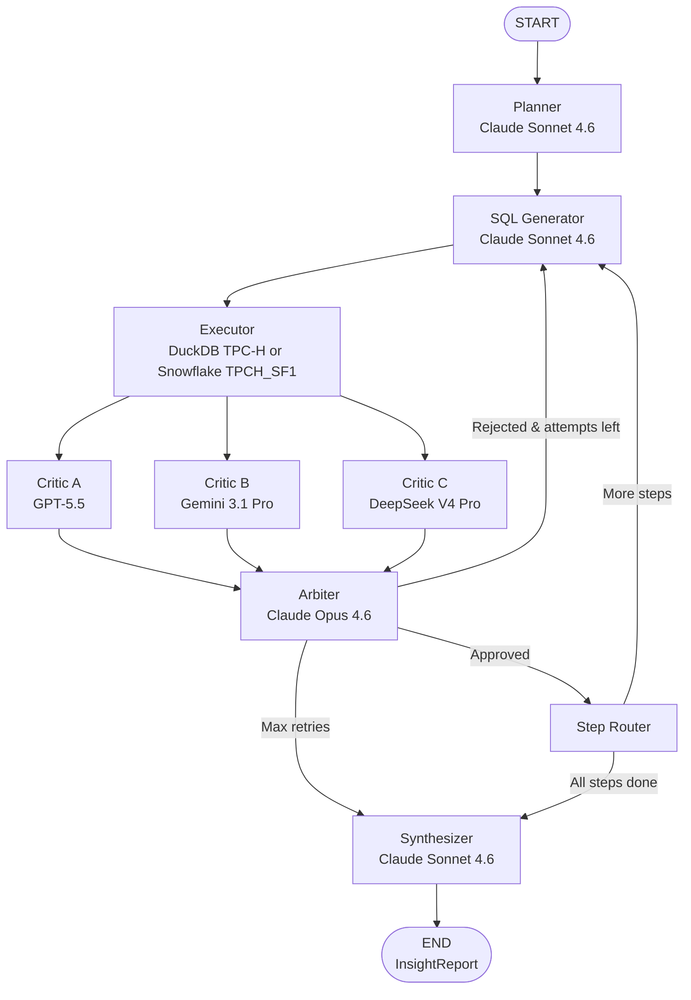

# Quorum

Quorum is an agentic data analyst that turns a natural-language business question into SQL, executes against local DuckDB TPC-H data by default, critiques the result with a multi-model panel, and returns a structured `InsightReport`. Snowflake remains available as an optional backend. It is built as a portfolio-grade demonstration of typed agent orchestration, deterministic safety checks, and model disagreement analysis.

## Architecture



## Technology Stack

**LangGraph** coordinates the workflow as a state graph: planning, SQL generation, execution, independent critics, arbitration, step routing, and synthesis. The public interfaces are `run_agent(question: str)` and `stream_agent(question: str)`.

**DuckDB** provides the default local execution layer through generated TPC-H tables, so the app can run without a Snowflake account. Snowflake remains available by setting `QUORUM_DATABASE_BACKEND=snowflake`. Generated SQL uses unqualified table names such as `ORDERS` and `LINEITEM` for both backends.

**Pydantic v2** defines every business payload crossing node boundaries, including `AgentState`, `QueryPlan`, `ValidatedQuery`, `QueryResult`, `CritiqueResult`, `ArbitrationResult`, and `InsightReport`.

**Multi-model critique** uses OpenAI, Google, and DeepSeek critics before a Claude arbiter decides whether to accept, retry, or gracefully exit. This improves diversity of review, but it does not prove correctness.

**Streamlit** provides the portfolio demo UI with streamed graph progress, generated SQL, critic votes, caveats, and a JSON report download.

## Ensemble Critique System

Quorum does not trust successful SQL execution by itself. After the database returns a `QueryResult`, three independent critics evaluate whether the result actually satisfies the current plan step: GPT-5.5, Gemini 3.1 Pro Preview, and DeepSeek V4 Pro.

LLM-as-judge alone is insufficient because a single model can miss semantic SQL errors, over-credit plausible-looking outputs, or share blind spots with the SQL generator. Quorum uses three critics from different providers, then asks a separate Claude Opus arbiter to compare their reasoning. The arbiter's `disagreement_analysis` is meant to expose where critics agree, where they diverge, and which shared assumptions could still be wrong.

This ensemble pattern improves review coverage, but it does not eliminate correlated LLM failure. The final report should be treated as analyst assistance, not as a guaranteed audit result.

## DeepSeek Via Anthropic Format

DeepSeek V4 Pro is called through its Anthropic-compatible endpoint, so Quorum uses the existing Anthropic SDK wrapper with `base_url=https://api.deepseek.com/anthropic`. No separate DeepSeek SDK is required. The DeepSeek critic must use `deepseek-v4-pro`; deprecated model strings such as `deepseek-chat` and `deepseek-reasoner` are intentionally not used.

## Setup

Prerequisites:
- Python 3.11+
- API keys for Anthropic, OpenAI, Google AI Studio, and DeepSeek
- Optional: a Snowflake account if you want the cloud backend instead of local DuckDB

Install:

```bash
pip install -e ".[dev]"
```

Create a local `.env` from `.env.example` and fill in credentials. Do not commit `.env`.

```bash
copy .env.example .env
```

Useful provider links:
- Google AI Studio: https://aistudio.google.com/
- DeepSeek platform: https://platform.deepseek.com/
- Optional Snowflake trial: https://signup.snowflake.com/

Run tests:

```bash
pytest tests/ -v
```

Run the Streamlit demo:

```bash
python -m streamlit run app.py
```

## Environment Variables

Required LLM keys:

```text
ANTHROPIC_API_KEY
OPENAI_API_KEY
GOOGLE_API_KEY
DEEPSEEK_API_KEY
DEEPSEEK_BASE_URL
```

Default local database settings:

```text
QUORUM_DATABASE_BACKEND=duckdb
QUORUM_DUCKDB_PATH=data/quorum_tpch.duckdb
QUORUM_DUCKDB_TPCH_SCALE=0.1
QUORUM_DUCKDB_INIT_TPCH=true
```

`QUORUM_DUCKDB_TPCH_SCALE=0.1` is a fast local demo with roughly 600K `LINEITEM` rows. Increase it to `1` for a larger TPC-H dataset after the app is working.

Optional Snowflake settings:

```text
QUORUM_DATABASE_BACKEND=snowflake
SNOWFLAKE_ACCOUNT
SNOWFLAKE_USER
SNOWFLAKE_PASSWORD
SNOWFLAKE_WAREHOUSE
SNOWFLAKE_DATABASE
SNOWFLAKE_SCHEMA
SNOWFLAKE_ROLE
```

For the TPCH demo, use:

```text
SNOWFLAKE_DATABASE=SNOWFLAKE_SAMPLE_DATA
SNOWFLAKE_SCHEMA=TPCH_SF1
```

## Example Questions

1. Which customers generated the most revenue?
   Expected output: ranked customer table with revenue calculated from `L_EXTENDEDPRICE * (1 - L_DISCOUNT)`.

2. Which market segments have the highest order value?
   Expected output: segment-level aggregate revenue and order counts.

3. Which nations have the largest supplier account balances?
   Expected output: ranked nations with supplier counts and balance totals.

4. Which order priorities are associated with the highest total order price?
   Expected output: priority-level totals and average order value.

5. Which part brands appear most often in line items?
   Expected output: ranked part brands by line item count.

6. Which ship modes are associated with the largest revenue?
   Expected output: ship-mode revenue table with row-limit caveats.

## Design Decisions

**LangGraph over a simple chain:** the project is intentionally a graph because retries, arbitration, multi-step routing, and streaming progress are central to the portfolio signal.

**Pydantic at every boundary:** model outputs are parsed into typed schemas before downstream nodes use them. LangGraph update dictionaries are framework envelopes; business data stays typed.

**Deterministic SQL safety:** `quorum/tools/sql_validator.py` requires a single `SELECT` or CTE query, rejects obvious multi-statement SQL, rejects fully qualified TPCH table names, appends `LIMIT 50` when missing, and caps limits above 100.

**Three-critic diversity:** the critic panel intentionally spans OpenAI, Google, and DeepSeek. Diversity reduces dependence on one judge, but it is not a correctness proof.

**TPCH for v1:** TPCH is stable, generated locally by DuckDB, available in Snowflake, and enough to demonstrate joins, aggregates, ranking, and business metrics. It is sample data, so demo conclusions should not be presented as real company insights.

## Data Sovereignty And Provider Risks

DeepSeek is a Chinese AI company. It is included here for portfolio demonstration and model-diversity value, but this exact provider mix is not automatically appropriate for production client data or regulated workloads. For sensitive deployments, review data residency, retention, contractual terms, and provider governance before enabling any external model.

Gemini is used through a preview model string, `gemini-3.1-pro-preview`. Preview models can change behavior, availability, or stability; if that model becomes unavailable, document any substitution clearly.

## Limitations

- Multi-model critique can still miss shared assumptions or correlated model failures.
- The SQL validator is intentionally conservative and may reject some valid SQL patterns.
- The Streamlit app depends on live provider credentials for a full demo; DuckDB removes the Snowflake signup dependency.
- Results are limited to 100 rows by design.
- Database syntax errors are returned as failed `QueryResult` objects and may require retry.
